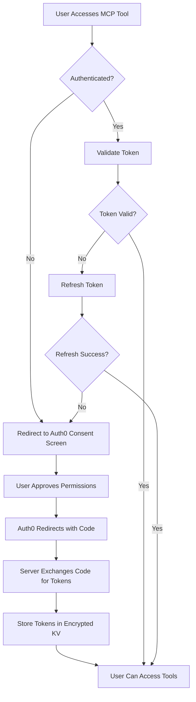

# Security Guidelines

## Overview

This document outlines the security architecture, best practices, and guidelines for the Specification Version Control MCP Server. The system implements enterprise-grade security measures to protect user data and ensure proper authentication and authorization.

## Security Architecture

### Authentication Flow



### Multi-Layer Security Model

1. **Transport Layer**: HTTPS/TLS 1.3 encryption
2. **Authentication Layer**: OAuth 2.0 with PKCE
3. **Authorization Layer**: JWT token validation
4. **Data Layer**: User isolation and encrypted storage
5. **Application Layer**: Input validation and sanitization

## Authentication & Authorization

### OAuth 2.0 Implementation

```typescript
// PKCE Flow Implementation
const codeVerifier = oauth.generateRandomCodeVerifier();
const codeChallenge = await oauth.calculatePKCECodeChallenge(codeVerifier);

// State parameter for CSRF protection
const transactionState = oauth.generateRandomState();
const consentToken = oauth.generateRandomState();
```

#### Security Features:

- **PKCE (Proof Key for Code Exchange)**: Prevents authorization code interception
- **State Parameter**: Prevents CSRF attacks
- **Short-lived Tokens**: Access tokens expire in 15 minutes
- **Token Rotation**: Refresh tokens are rotated on each use
- **Secure Storage**: All tokens encrypted in Cloudflare KV

### JWT Token Validation

```typescript
// Token validation in every tool
if (!this.props?.claims?.sub) {
  return {
    content: [
      {
        type: "text",
        text: JSON.stringify({
          error: "Authentication required",
          message: "User must be authenticated",
        }),
      },
    ],
  };
}
```

### Permission-Based Access Control

```typescript
// Permission checking utility
export function hasPermission(
  userPermissions: string[] | undefined,
  requiredPermission: string
): boolean {
  return userPermissions?.includes(requiredPermission) ?? false;
}

// Tool-level permission enforcement
export function requirePermission(permission: string, handler: Function) {
  return async (params: any, context: any) => {
    const userPermissions = context.props?.permissions || [];
    if (!hasPermission(userPermissions, permission)) {
      return {
        content: [
          {
            type: "text",
            text: JSON.stringify({
              error: "Permission denied",
              message: `This action requires the '${permission}' permission`,
            }),
          },
        ],
      };
    }
    return handler(params, context);
  };
}
```

## Data Protection

### User Data Isolation

Every database query includes user-specific filtering:

```sql
-- Example: All queries filter by user_id
SELECT * FROM specifications
WHERE user_id = ? AND id = ?;

-- Index for performance
CREATE INDEX idx_user_id ON specifications(user_id);
```

### Data Encryption

1. **At Rest**: Cloudflare D1 provides encryption at rest
2. **In Transit**: TLS 1.3 for all HTTP communications
3. **Token Storage**: Encrypted in Cloudflare KV
4. **Sensitive Data**: Never logged or exposed in errors

### Data Privacy Compliance

- **GDPR Compliance**: Right to access, rectify, and delete data
- **Data Minimization**: Only collect necessary user information
- **Retention Policies**: Automatic token cleanup and expiration
- **Audit Logging**: All actions logged with user context

## Input Validation & Sanitization

### Zod Schema Validation

```typescript
// All inputs validated with Zod
const createSpecificationSchema = z.object({
  title: z.string().min(1).max(200),
  content: z.string().min(1).max(50000),
  version: z.string().regex(/^\d+\.\d+\.\d+$/),
  tags: z.array(z.string()).max(10),
  description: z.string().max(500).optional(),
});
```

### SQL Injection Prevention

```typescript
// Always use parameterized queries
const result = await this.env.DB.prepare(
  "SELECT * FROM specifications WHERE id = ? AND user_id = ?"
)
  .bind(id, userId)
  .first();

// NEVER use string concatenation for SQL
// BAD: `SELECT * FROM specifications WHERE id = ${id}`
```

### XSS Prevention

```typescript
// All output is JSON-encoded
return {
  content: [
    {
      type: "text",
      text: JSON.stringify({
        title: sanitizedTitle,
        content: sanitizedContent,
      }),
    },
  ],
};
```

## Security Headers & CORS

### Security Headers

```typescript
// Implemented in the Cloudflare Worker
const securityHeaders = {
  "X-Content-Type-Options": "nosniff",
  "X-Frame-Options": "DENY",
  "X-XSS-Protection": "1; mode=block",
  "Strict-Transport-Security": "max-age=31536000; includeSubDomains",
  "Content-Security-Policy": "default-src 'self'",
};
```

### CORS Configuration

```typescript
// Restrictive CORS policy
const corsHeaders = {
  "Access-Control-Allow-Origin": "https://trusted-domain.com",
  "Access-Control-Allow-Methods": "POST, GET, OPTIONS",
  "Access-Control-Allow-Headers": "Content-Type, Authorization",
  "Access-Control-Max-Age": "86400",
};
```

## Error Handling & Logging

### Secure Error Handling

```typescript
// Good: Generic error messages
return {
  content: [
    {
      type: "text",
      text: JSON.stringify({
        error: "Authentication required",
        message: "User must be authenticated",
      }),
    },
  ],
};

// Bad: Exposing internal details
// return { error: `SQL error: ${error.message}` };
```

### Audit Logging

```typescript
// Log security events
console.log(
  `[SECURITY] User ${userId} accessed ${toolName} at ${new Date().toISOString()}`
);
console.log(`[AUTH] User ${userId} logged out at ${new Date().toISOString()}`);
console.log(`[PERMISSION] User ${userId} denied access to ${permission}`);
```

## Rate Limiting & DoS Protection

### Cloudflare Protection

- **DDoS Protection**: Cloudflare's global network
- **Rate Limiting**: Built-in Cloudflare Workers rate limiting
- **IP Reputation**: Automatic blocking of malicious IPs

### Application-Level Limits

```typescript
// Implement per-user rate limiting
const rateLimitKey = `rate_limit:${userId}`;
const requestCount = await this.env.KV.get(rateLimitKey);

if (requestCount && parseInt(requestCount) > 100) {
  return { error: "Rate limit exceeded" };
}
```

## Secure Configuration

### Environment Variables

```toml
# wrangler-auth0.toml - Public configuration (placeholders; do not commit real IDs)
AUTH0_DOMAIN = "YOUR_TENANT.auth0.com"
AUTH0_CLIENT_ID = "YOUR_CLIENT_ID"
AUTH0_AUDIENCE = "urn:specification-mcp-server"

# Secrets (never in configuration files)
# AUTH0_CLIENT_SECRET - Set via: wrangler secret put AUTH0_CLIENT_SECRET
```

### Secrets Management

```bash
# Set secrets securely
wrangler secret put AUTH0_CLIENT_SECRET
wrangler secret put DATABASE_ENCRYPTION_KEY
wrangler secret put JWT_SIGNING_SECRET

# List secrets (without values)
wrangler secret list

# Delete secrets
wrangler secret delete SECRET_NAME
```

## Security Testing

### Regular Security Audits

1. **Token Validation Testing**

   ```bash
   # Test with expired tokens
   curl -X POST https://your-app.workers.dev/mcp \
     -H "Authorization: Bearer EXPIRED_TOKEN" \
     -d '{"method": "list_specifications"}'
   ```

2. **User Isolation Testing**

   ```bash
   # Verify users can't access other users' data
   # Create data as User A, try to access as User B
   ```

3. **Input Validation Testing**
   ```bash
   # Test with malicious inputs
   curl -X POST https://your-app.workers.dev/mcp \
     -d '{"method": "create_specification", "params": {"title": "<script>alert(1)</script>"}}'
   ```

### Penetration Testing Checklist

- [ ] Authentication bypass attempts
- [ ] SQL injection testing
- [ ] XSS payload testing
- [ ] CSRF token validation
- [ ] Rate limiting verification
- [ ] User isolation testing
- [ ] Token manipulation testing
- [ ] Permission escalation attempts

## Incident Response

### Security Incident Procedures

1. **Immediate Response**
   - Disable affected user accounts
   - Revoke compromised tokens
   - Enable enhanced logging

2. **Investigation**
   - Analyze audit logs
   - Identify attack vectors
   - Assess data exposure

3. **Recovery**
   - Patch vulnerabilities
   - Reset affected credentials
   - Notify affected users

### Monitoring & Alerting

```typescript
// Set up alerts for suspicious activity
if (failedAuthAttempts > 5) {
  console.log(`[ALERT] Multiple failed auth attempts for user ${userId}`);
  // Trigger notification to security team
}

if (unusualAPIUsage) {
  console.log(`[ALERT] Unusual API usage pattern detected for user ${userId}`);
  // Implement temporary rate limiting
}
```

## Compliance & Standards

### Security Standards

- **OWASP Top 10**: Protection against common vulnerabilities
- **OAuth 2.0 RFC 6749**: Standard authentication flow
- **PKCE RFC 7636**: Enhanced security for public clients
- **JWT RFC 7519**: Secure token format

### Compliance Frameworks

- **SOC 2 Type II**: Security controls and monitoring
- **GDPR**: Data protection and privacy rights
- **CCPA**: California Consumer Privacy Act compliance
- **HIPAA**: Healthcare data protection (if applicable)

## Security Best Practices for Developers

### Code Review Checklist

- [ ] All database queries use parameterized statements
- [ ] User authentication is checked in every tool
- [ ] Input validation uses Zod schemas
- [ ] Error messages don't expose sensitive information
- [ ] All user actions are logged with context
- [ ] Secrets are not hardcoded in source code
- [ ] HTTPS is enforced for all communications

### Secure Development Guidelines

1. **Authentication First**: Always check authentication before processing
2. **Validate Everything**: Use Zod for all input validation
3. **Principle of Least Privilege**: Grant minimum required permissions
4. **Fail Securely**: Default to deny access on errors
5. **Log Security Events**: Maintain audit trails
6. **Regular Updates**: Keep dependencies updated

## Emergency Contacts

### Security Team

- **Email**: security@yourcompany.com
- **Phone**: +1-555-SECURITY
- **PagerDuty**: security-team

### Incident Response

- **Primary**: security-lead@yourcompany.com
- **Secondary**: tech-lead@yourcompany.com
- **Escalation**: cto@yourcompany.com

---

**Last Updated**: January 2025
**Next Review**: April 2025
**Document Owner**: Security Team

For questions or security concerns, contact the security team immediately.
